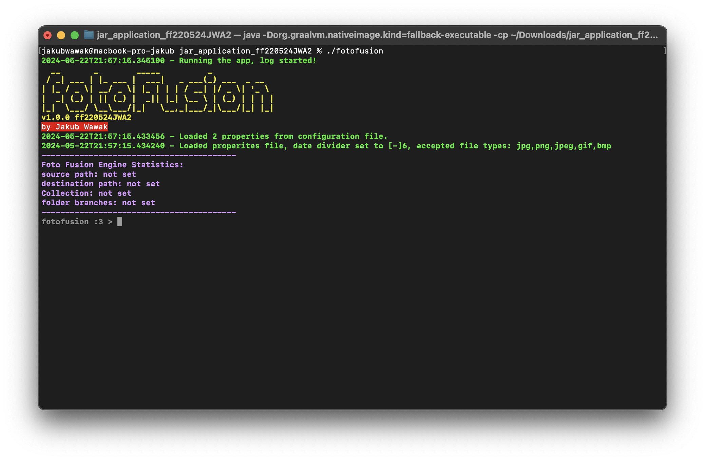

# FotoFusion



FotoFusion is a Java-based application designed to manage and manipulate photo collections. It provides functionalities such as setting source and destination paths, generating collections, loading photo EXIF data, adding and removing tag branches, and copying photos.


## Features

- **Set Source and Destination Paths**: The application allows you to set the source and destination paths for your photo collections.

- **Generate Collections**: The application can generate a collection of photos from the source path.

- **Load Photo EXIF Data**: The application can load EXIF data from the photos in the collection.

- **Add and Remove Tag Branches**: The application allows you to add and remove tag branches to/from all photos in the collection.

- **Copy Photos**: The application can copy photos from the source path to the destination path, creating necessary directories if they do not exist.

## Getting Started

To run the FotoFusion Engine, you need to have Java installed on your machine or you have to download the executable for your system from the Relases page.
To run the jar file, you can use the following command:

```bash
java -jar FotoFusion.jar
```
## Console UI Guide
## Available Commands
### Commands for setting up the program
- `exit`<br>
  Exits the console and the program. Program saves the current log in the working directory.
- `clear`<br>
  Clears the console.
- `reset`<br>
  Clears the current source, destination, and photo collection.
- `showhistory`<br>
  Shows the history of the commands typed in the console.
### Commands for setting the engine
- `setsource <source>`<br>
  Sets the source of the engine. The source can be a file or a directory.
- `setdestination <destination>`<br>
  Sets the destination of the engine. The destination can be a file or a directory.
- `runcollection`<br>
  Runs the photo grab from the current source.
- `runexifloader`<br>
  Runs the exif loader for the current photo collection.
- `listbranches`<br>
  Lists the branches (common tags) of the current photo collection.
- `addbranch <branch>`<br>
  Adds a branch (common tag) to the current photo collection.
- `removebranch <branch>`<br>
  Removes a branch (common tag) from the current photo collection.
- `runcopy`<br>
  Runs the copy engine for the current photo collection.
- `showstats`<br>
  Shows the statistics of the current photo collection.
## Example Usage
<br>1.`setsource /home/user/photos`<br>
Sets the source of the engine to `/home/user/photos`.
<br>2.`setdestination /home/user/destination`<br>
Sets the destination of the engine to `/home/user/destination`.
<br>3.`runcollection`<br>
Runs the photo grab from the current source.
<br>4.`runexifloader`<br>
Runs the exif loader for the current photo collection.
<br>5.`listbranches`<br>
Lists the branches (common tags) of the current photo collection.
<br>6.`addbranch vacation`<br>
Adds a branch (common tag) to the current photo collection.
<br>7.`removebranch vacation`<br>
Removes a branch (common tag) from the current photo collection.
<br>8.`runcopy`<br>
Runs the copy engine for the current photo collection.
## Contributing

Contributions are welcome. Please fork this repository and create a pull request if you have something you want to add or improve.

## License

This project is licensed under the terms of the MIT license.